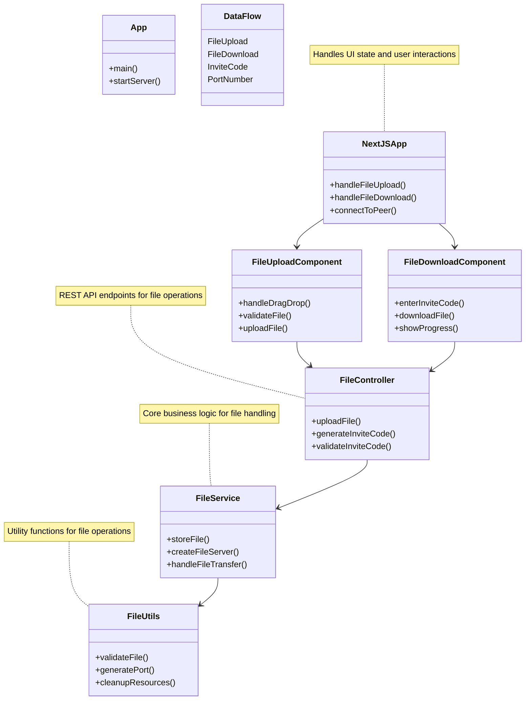

# PeerLink - P2P File Sharing Application

PeerLink is a peer-to-peer file sharing application that allows users to share files directly between devices using a simple invite code system.

## Project Structure

- `src/main/java/p2p`: Java backend code
  - `App.java`: Main application entry point
  - `controller/`: API controllers
  - `service/`: Business logic services
  - `utils/`: Utility classes
- `ui/`: Next.js frontend application
  - `src/app`: Next.js app router pages
  - `src/components`: React components

## Features

- Drag and drop file upload
- File sharing via invite codes (port numbers)
- File downloading using invite codes
- Modern, responsive UI
- Direct peer-to-peer file transfer

## Prerequisites

- Java 11+ (for the backend)
- Node.js 18+ and npm (for the frontend)
- Maven (for building the Java project)

## Getting Started

# PeerLink Deployment Guide

This guide outlines several easy deployment options for the PeerLink application, covering both the Java backend and Next.js frontend.

## Deployment Options

### Option 1: Local Network Deployment

The simplest deployment for a P2P application is to run it on a computer within your local network.

1. Build the application:
   ```bash
   mvn clean package
   cd ui && npm run build && cd ..
   ```

2. Run the backend:
   ```bash
   java -jar target/p2p-1.0-SNAPSHOT.jar
   ```

3. Run the frontend (production mode):
   ```bash
   cd ui && npm start
   ```

4. Access the application at `http://localhost:3000`
5. Share your local IP address with others on the same network to access the application

### Option 2: Docker Deployment

Docker makes it easy to package and deploy both components. We've already created the necessary files for you:

- `Dockerfile.backend` - Docker configuration for the Java backend
- `Dockerfile.frontend` - Docker configuration for the Next.js frontend
- `docker-compose.yml` - Docker Compose configuration to run both services

To deploy with Docker:

1. Make sure Docker and Docker Compose are installed on your system
2. Run with Docker Compose:
   ```bash
   docker-compose up -d
   ```

This will build and start both the backend and frontend services. The frontend will be available at http://localhost:3000 and the backend at http://localhost:8080.

### Option 3: Cloud Deployment

#### Backend Deployment

##### Heroku (Easiest)

We've already created a `Procfile` for Heroku deployment. To deploy:

1. Create a Heroku app and deploy:
   ```bash
   heroku create peerlink-backend
   git push heroku main
   ```

##### Railway

1. Connect your GitHub repository to Railway
2. Add a new service using the Java template
3. Set the build command: `mvn clean package`
4. Set the start command: `java -jar target/p2p-1.0-SNAPSHOT.jar`

#### Frontend Deployment

##### Vercel (Optimized for Next.js)

1. Connect your GitHub repository to Vercel
2. Set the root directory to `ui`
3. Vercel will automatically detect Next.js and deploy it

##### Netlify

1. Build the frontend:
   ```bash
   cd ui && npm run build
   ```

2. Deploy the `ui/out` directory to Netlify

### Option 4: Virtual Private Server (VPS)

For complete control, deploy to a VPS like DigitalOcean, Linode, or AWS EC2. We've created helper files to make this process easier:

- `vps-setup.sh` - A script that automates the setup process on Ubuntu/Debian VPS
- `nginx.conf.example` - A sample Nginx configuration with HTTPS and security headers

#### Automated Setup

1. SSH into your server
2. Upload the project files to your server
3. Make the setup script executable and run it:
   ```bash
   chmod +x vps-setup.sh
   ./vps-setup.sh
   ```
   
4. Follow the prompts and instructions during the setup process

#### Manual Setup

If you prefer to set up manually:

1. SSH into your server
2. Install Java, Node.js, Nginx, and PM2
3. Clone your repository
4. Build both applications:
   ```bash
   mvn clean package
   cd ui && npm install && npm run build
   ```

5. Use a process manager like PM2:
   ```bash
   # For the backend
   pm2 start --name peerlink-backend java -- -jar target/p2p-1.0-SNAPSHOT.jar
   
   # For the frontend
   cd ui
   pm2 start npm --name peerlink-frontend -- start
   ```

6. Set up Nginx as a reverse proxy using the provided `nginx.conf.example` as a template:
   ```bash
   sudo cp nginx.conf.example /etc/nginx/sites-available/peerlink
   sudo ln -sf /etc/nginx/sites-available/peerlink /etc/nginx/sites-enabled/
   sudo nginx -t
   sudo systemctl restart nginx
   ```

7. Set up SSL with Let's Encrypt:
   ```bash
   sudo apt install -y certbot python3-certbot-nginx
   sudo certbot --nginx -d yourdomain.com
   ```

## Important Considerations for P2P Applications

Since PeerLink is a P2P application that uses dynamic ports for file sharing:

1. **Port Forwarding**: For internet-wide P2P functionality, configure port forwarding on your router for the dynamic port range (49152-65535)

2. **Firewall Configuration**: Ensure your firewall allows connections on these ports

3. **NAT Traversal**: Consider implementing STUN/TURN servers for NAT traversal if deploying for wide-scale use

4. **Security**: For production deployment, implement:
   - HTTPS for the frontend and API
   - Authentication system
   - File encryption
   - Rate limiting

## Recommended Approach for Beginners

For the easiest deployment:

1. **Backend**: Deploy to Railway or Heroku
2. **Frontend**: Deploy to Vercel

This combination provides:
- Zero server configuration
- Automatic HTTPS
- Easy scaling
- Free tier options for testing

## Monitoring and Scaling

Once deployed, consider:

1. Adding application monitoring with tools like New Relic or Datadog
2. Setting up logging with ELK stack or a cloud logging service
3. Implementing a database for user accounts and file metadata
4. Adding a CDN for improved performance

Remember that the current implementation is designed for demonstration purposes. For a production-ready P2P file sharing service, additional work on security, scalability, and reliability would be necessary.

## How It Works

1. **File Upload**:
   - User uploads a file through the UI
   - The file is sent to the Java backend
   - The backend assigns a unique port number (invite code)
   - The backend starts a file server on that port

2. **File Sharing**:
   - The user shares the invite code with another user
   - The other user enters the invite code in their UI

3. **File Download**:
   - The UI connects to the specified port
   - The file is transferred directly from the host to the recipient

## Architecture

```
┌─────────────┐      ┌─────────────┐      ┌─────────────┐
│             │      │             │      │             │
│  Next.js UI │◄────►│ Java Server │◄────►│ Peer Device │
│             │      │             │      │             │
└─────────────┘      └─────────────┘      └─────────────┘
```

## Low Level Design (LLD)



### Component Details

1. **Frontend Components**
   - `NextJSApp`: Main application component managing state and routing
   - `FileUploadComponent`: Handles drag-and-drop file uploads
   - `FileDownloadComponent`: Manages file downloads using invite codes

2. **Backend Components**
   - `App`: Main application entry point and server initialization
   - `FileController`: REST API endpoints for file operations
   - `FileService`: Core business logic for file handling
   - `FileUtils`: Utility functions for file validation and port management

3. **Data Flow**
   - File uploads are handled through drag-and-drop
   - Invite codes (port numbers) are generated for sharing
   - Direct peer-to-peer file transfer using WebSocket connections

## Security Considerations

- This is a demo application and does not include encryption or authentication
- For production use, consider adding:
  - File encryption
  - User authentication
  - HTTPS support
  - Port validation and security

## Deployment

For detailed deployment instructions, see [DEPLOYMENT.md](DEPLOYMENT.md).

Options include:
- Local network deployment
- Docker deployment (using provided Dockerfile.backend, Dockerfile.frontend, and docker-compose.yml)
- Cloud deployment (Heroku, Railway, Vercel, Netlify)
- VPS deployment

## License

MIT
